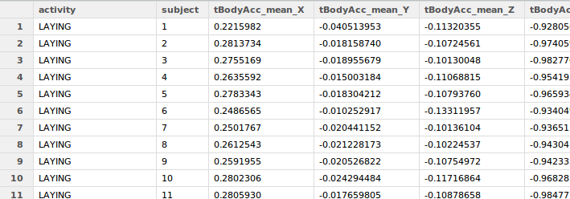

# Quick start

- Clone this repository
- Put the data-file in the same directory as "run_analysis.R" 
- startup R and source "run_analysis.R" 
- after a while of huffing and puffing, you get the final tidy dataset in dataframe **`df`**

It will look like this, when opened in rstudio: 

# Extras

# DRAFT AFTER THIS LINE 

# Detail 

The original tasks read as follows:

You should create one R script called `run_analysis.R` that does the following.

1. Merges the training and the test sets to create one data set.
2. Extracts only the measurements on the mean and standard deviation for each measurement.
3. Uses descriptive activity names to name the activities in the data set
4. Appropriately labels the data set with descriptive variable names.
5. From the data set in step 4, creates a second, independent tidy data set with the average of each variable for each activity and each subject.

## Item 1: Merges the training and the test sets to create one data set. 

Result in : *dfcom*  (aka the comprehensive dataframe) 

This dataframe contains each and every record that is in the files, and captures all the information. 

TODO ? Describe columns. 

TODO: describe double checking

TODO: additional data provided by the script : 
    - id_cols: vector with the names of all the id-columns in df_exh 
    - measure_colnames: vector with the measure names in df_exh 
    - `colnames`: vector with ALL names of all the columns, it is the union of concatenation of id_cols and measure_colnames

- mention the observation_type column

- describe how to melt?

## Item 2: Extracts only the measurements on the mean and standard deviation for each measurement.

Result in *dfsel* (aka the selective dataframe) 

dimensions.

Additional objects: 

    - selcolnames: the selective colnames

    - 

## Item 3: Uses descriptive activity names to name the activities in the data set

The activity column, already present in `dfc` and `dfs` contains the activity name. 

## Item 4: Appropriately labels the data set with descriptive variable names.

See the appropriately named columns of `dfc` and `dfs`. 

## Item 5: from the data set in step 4, creates a second, independent tidy data set set with the average of each variable for each activity and each subject.

This item is stored in object `dfavg` (aka the averages dataframe). 
This result has been generated by first 'melting' the `dfs` dataframe to a narrow representation (dfnrw), and then applying plyr's ddply() function on it. 

